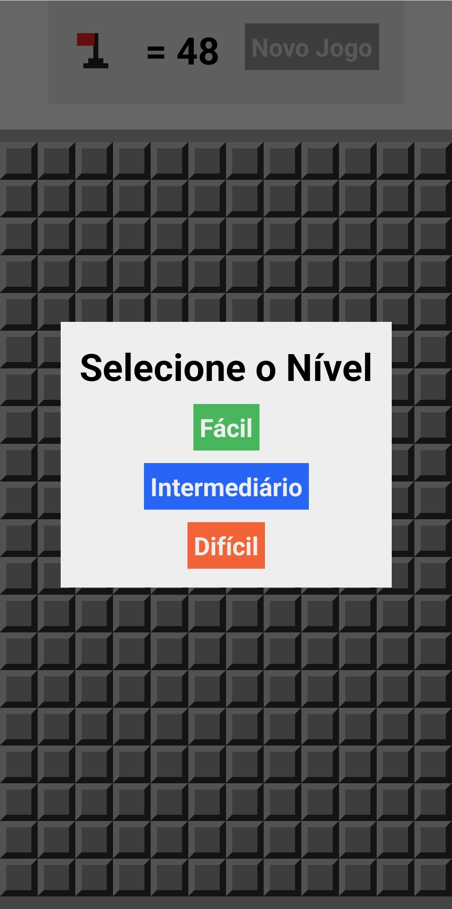
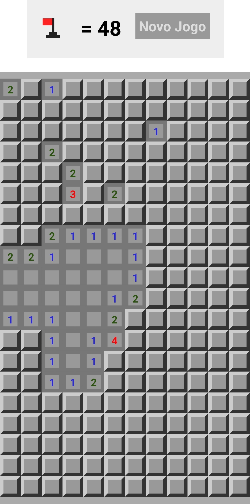
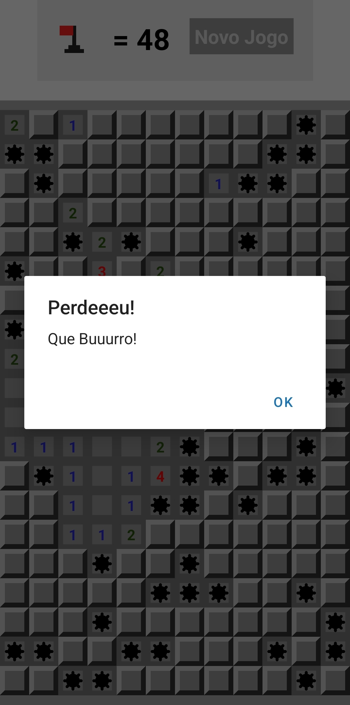

<h1> Minesweeper Project in </h1>
<p> Project created to study react native, Minesweeper. </p>

image of the application running <br>


<br><br>





# Minesweeper in React and Expo

## Introduction
This project consists of developing a Minesweeper game using React and Expo. The main goal was to improve front-end development skills and better understand how games and complex interactions work in mobile applications.

## Motivation
The choice to develop a Minesweeper came from the desire to practice fundamental React concepts, such as state, props and functional components, in addition to exploring the Expo environment for building interactive mobile games.

## Learnings
During the development of this project, several important pieces of knowledge were acquired, including:

### 1. State Handling
- Using the `useState` hook to manage the state of cells, bombs and game status.
- Updating state efficiently to ensure fluid gameplay.

### 2. Componentization
- Creating reusable components for board cells and status indicators.
- Modular organization of the code to improve readability and facilitate maintenance.

### 3. Styling
- Using React Native's `StyleSheet` to style the board and visual elements.
- Adapting the layout to different screen sizes, ensuring a consistent user experience.

### 4. Game Logic
- Implementing Minesweeper rules, including opening cells, marking flags, and detecting bombs.
- Handling victory, defeat, and restart conditions.

### 5. Integration with Expo
- Understanding the development and testing flow with Expo Go.
- Using Expo tools to facilitate debugging and iterative development.

## Challenges Encountered
- Efficiently managing the state of the board with multiple cells.
- Ensuring responsiveness and usability on different mobile devices.
- Dealing with unexpected conditions during the game.

## Conclusion
The development of this Minesweeper provided a better understanding of the fundamentals of React and the Expo environment. It was possible to improve skills in componentization, state management and game logic, in addition to tackling challenges that reflect real problems in mobile application development.

This project serves as a foundation for future more complex work and highlights the importance of organizational practices and writing clean and reusable code.


_When downloading the files you will have to run the command._

```sh
cd calculator
npx expo
```
_requirements:_ <br>
**Node installed**

## Documentation

To explore the updated documentation.

_To access the React Native documentation, usage [React Native](https://reactnative.dev/docs/environment-setup)._ <br>
_To access the NodeJS documentation, usage [NodeJS](https://nodejs.org/pt)._ <br>
_To access the Expo documentation, usage [Expo](https://expo.dev)._
## Meta

Your Name – [@7hallis](https://x.com/7hallis) – thallisffc@gmail.com

Distributed under the 7hallis license. See `LICENSE` for more information.

[https://github.com/7hallis](https://github.com/7hallis)
